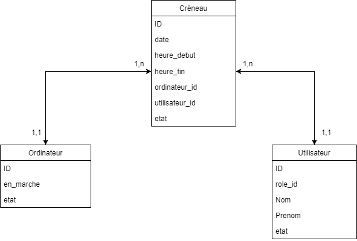

# Rezordi - Application de Gestion d'attribution d'ordinateurs

rezordi.razafin-andry.fr

## Deux versions

Il existe deux versions de cette application :
- une version only Laravel qui n'est pas en ligne, et il manque la partie connexion et des middlewares pour protéger les chemins
- une version VueJS & Laravel, en ligne et à peu près complète

## Objectif 

Une application sécurisée qui permet de gérer l'attribution des postes informatiques à des visiteurs d'un centre culturel sur les horaires d'ouvertures. 

À noter :

Chaque ordinateur ne peut avoir qu'une seule personne à la fois qui l'utilise.
C'est le/la secrétaire du centre qui gère l'attribution des postes et qui sera donc administrateur de l'application. 

## Stories 

| En tant que  |  je veux | afin de | critères d'acceptations |
|--|--|--|---------|
|Administrateur |  me connecter à une interface sécurisée | d'accèder à l'administration de l'application | - Formulaire de connexion   - Attribuer des identifiants   - Sécuriser le formulaire côté front et côté back |
|Administrateur|  créer un utilisateur | d'attribuer les postes | - Formulaire de création d'utilisateur   - Sécuriser le formulaire côté front & côté back   - Stocker dans ma BDD le nouvel utilisateur |
|Administrateur| modifier un utilisateur | corriger s'il y a eu des erreurs de saisie | - Formulaire de modification avec les informations de l'utilisateur souhaité   -  - Sécuriser le formulaire côté front & côté back   - Stocker dans ma BDD les modifications de l'utilisateur souhaité|
|Administrateur|supprimer un utilisateur|alléger la BDD et retirer les utilisateurs inactifs | - Bouton de suppression   - Fenêtre de confirmation de suppression   - Supprimer de la BDD l'utilisateur ainsi que tous ses liens avec les autres tables |
|Administrateur|  créer un ordinateur | d'attribuer les utilisateurs à des postes | - Formulaire de création d'ordinateur   - Sécuriser le formulaire côté front & côté back   - Stocker dans ma BDD le nouvel ordinateur |
|Administrateur| modifier un ordinateur | corriger s'il y a eu des erreurs de saisie | - Formulaire de modification avec les informations de l'ordinateur souhaité   -  - Sécuriser le formulaire côté front & côté back   - Stocker dans ma BDD les modifications de l'ordinateur|
|Administrateur|supprimer un ordinateur|alléger la BDD et retirer les postes inutilisées | - Bouton de suppression   - Fenêtre de confirmation de suppression   - Supprimer de la BDD l'ordinateur ainsi que tous ses liens avec les autres tables |
|Administrateur|attribuer un ordinateur à un utilisateur à une date et sur un créneau horaire| gérer les réservations| - Récupérer les ordinateurs et utilisateurs disponibles   - Associer une date & heure à un ordinateur et utilisateur   - Vérifier que le créneau n'est pas déjà pris | 
|Administrateur|voir toutes les attributions|voir les postes disponibles tel jour|- Liste avec les attributions|
|Administrateur|annuler une attribution|libérer un créneau si jamais il y a désistement |  - Bouton d'annulation   - Fenêtre de confirmation d'annulation   - Supprimer dans la BDD le créneau |

## Liens 

Trello : https://trello.com/b/gMGxi8Rx/rezordi

MCD :   